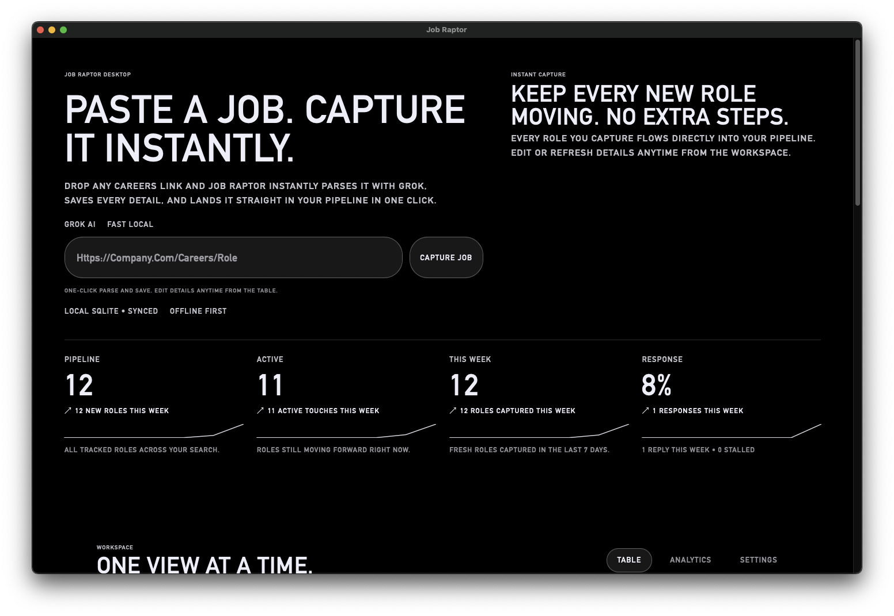
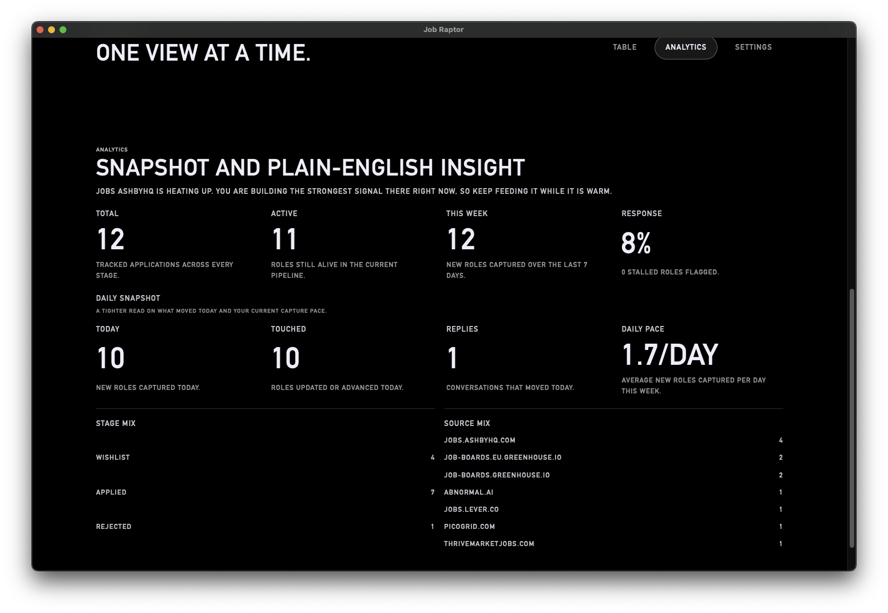
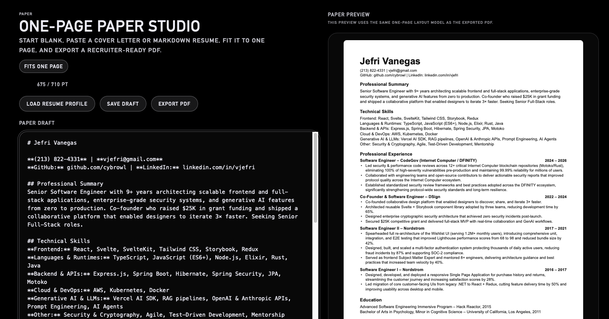

# Job Raptor

Job Raptor is a local-first desktop job search workspace built with SvelteKit, Tauri v2, and SQLite. It helps you capture job links in one click, rank roles against your resume with Grok, track applications locally, and turn pasted markdown resumes or cover letters into one-page exportable documents.

## What It Does

- Instant capture: paste a job URL and save it straight into the pipeline in one click
- Local-first storage: application data lives on-device in SQLite inside the Tauri desktop app
- AI-assisted parsing: Grok can enrich company, title, job description, fit summary, and confidence
- Resume-aware scoring: confidence can represent how well your saved resume matches the role
- Paper workspace: paste a markdown resume or plain-text cover letter, fit it to one page, and export PDF
- Backup portability: export and import your local pipeline and settings between dev and installed builds

## Screenshots

### Capture Dashboard



### Analytics Workspace



### Paper Workspace



## Stack

- `src/ui/`: SvelteKit + TypeScript desktop UI
- `src/ai/`: shared job parsing heuristics and parser helpers
- `tauri/`: native desktop shell, SQLite migrations, save/import commands, and Grok-backed desktop parsing

## Workspaces

### Table

The main pipeline view for saved roles. New pasted links land in `Wishlist` by default so you can review and advance them later.

### Paper

A one-page document workspace for:

- pasted markdown resumes
- plain-text cover letters
- PDF export from the desktop app

It starts blank by default. `Load Resume Profile` is optional and only used when you want to pull your saved resume into the editor.

### Analytics

Daily and weekly snapshots of your pipeline, including total roles, active roles, response rate, daily pace, and source mix.

### Settings

Local Grok configuration, resume upload / resume profile management, and backup import/export all live here.

## Quick Start

```bash
npm install
cp .env.example .env

# browser preview
npm run dev

# desktop shell
npm run tauri
```

## Grok Setup

You can save an xAI API key inside the app, or use environment variables during development:

- `XAI_API_KEY`
- `XAI_JOB_PARSER_MODEL` (optional, defaults to `grok-4-fast-non-reasoning`)

Without a Grok key, Job Raptor still works using the local parser fallback.

## Storage Model

- Tauri desktop mode uses local SQLite
- Browser preview mode falls back to `localStorage`
- Backup export/import moves saved applications, parser settings, resume profile data, and Paper drafts between environments

## Scripts

- `npm run dev`: start the SvelteKit app in browser mode
- `npm run check`: run `svelte-check`
- `npm run test`: run the Vitest suite
- `npm run build`: build static frontend assets into `build/`
- `npm run tauri`: launch the Tauri desktop shell
- `npm run tauri:build`: build the desktop app bundle

## Current Notes

- Job captures save into `Wishlist` by default
- `Refresh Pipeline` re-parses saved URLs with your current parser and resume settings
- The Paper workspace is optimized for pasted markdown resumes and plain-text cover letters
- PDF export for Paper uses the native desktop save dialog in Tauri
